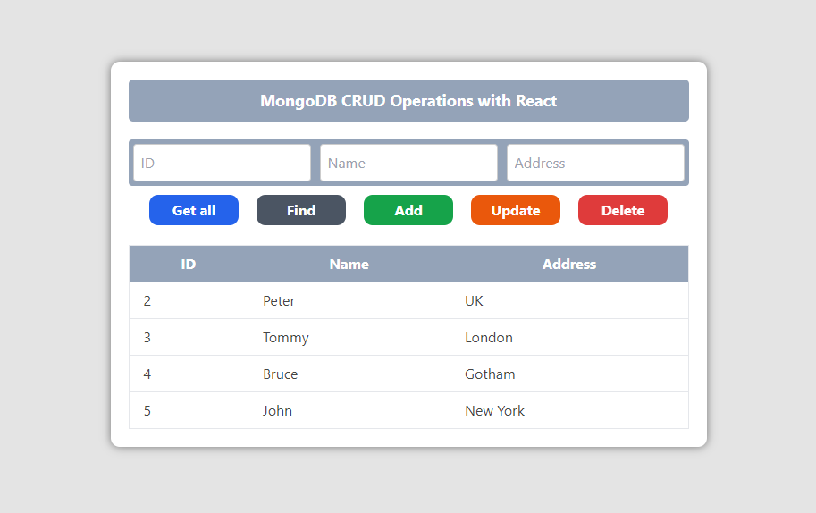

## MongoDB CRUD Operations with React

## Setup MongoDB 

### Backend

* `npx express-generator`
* `npm install`
* `npm install nodemon`
* `"dev":"nodemon ./bin/www"` add to scripts

 

* `npm install dotenv`
* create .env  
`PORT=4000 
MONGODB_URL=mongodb+srv://<username>:<password>@<cluster>.auajvjv.mongodb.net/?retryWrites=true&w=majority` 
* <a href='https://github.com/TheMIU/mongo-crud/commit/f7c78d903e7c66d1cbfeb173398879d9556739b3'> .env config </a>

 

* `npm install mongoose`
* <a href='https://github.com/TheMIU/mongo-crud/commit/9d656bc4f5bae7e8e0fe6e05a5e21d09b54f55f8'> mongo db connect </a>

 

* <a href='https://github.com/TheMIU/mongo-crud/commit/8ad4a9407731fa24255f473fd51a76abea3b9a65'> setup for perform CRUD operations (add customer) </a>
* check using Postman  
Post request URL : http://localhost:4000/customer/add   
Sample data : 
    <pre>
    {
        "id": "1",
        "name": "John",
        "address": "New York"
    }</pre>

* Others requests are similar to that.  
<a href='https://github.com/TheMIU/mongo-crud/blob/main/backend/routes/customer.js'> customer.js</a> , 
<a href='https://github.com/TheMIU/mongo-crud/blob/main/backend/controller/CustomerController.js'> CustomerController.js </a>

### Access Backend from Frontend

* create React app + <a href='https://docs.google.com/document/d/10LhKBZAp48qX8Ssb3ZdXgjIVL45jjLGOTNbuDSRcqvc/edit#heading=h.1vwgs3kdd3ny'> tailwind css </a>
* `npm install cors` (backend)
* <a href='https://github.com/TheMIU/mongo-crud/commit/d3185154471efbe1b581442875e21f84a42a962f'> Enable CORS </a> (backend)
* `npm install axios` (frontend) 
* Create frontend to manipulate the data.